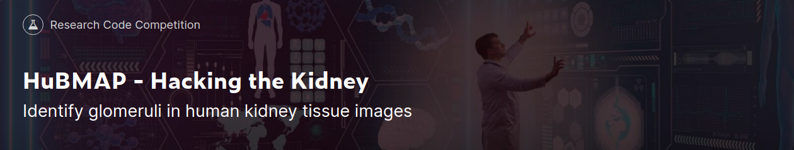
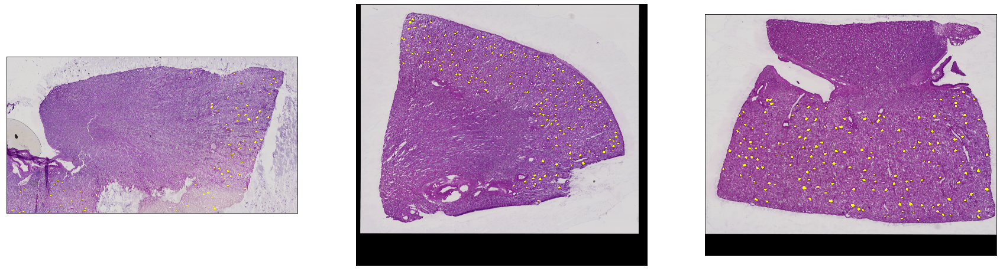
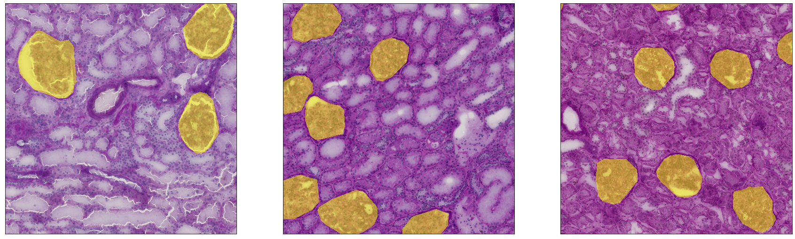

This repository contains code written during participation in Kaggle competition
['HuBMAP - Hacking the Kidney'](https://www.kaggle.com/c/hubmap-kidney-segmentation).

## Competition Description
### Task
Semantic segmentation: detection of functional tissue units (FTUs) across different tissue preparation pipelines.
### Data
15 train images and 5 test images. *(Amount of images in private dataset is unknown.)*
 Resolution: 30k x 37k pixels at average.
#### Preview - Full Images

#### Preview - Random 2048x2048 Crops

## Results
My model scored at 0.912 [Dice Coefficient](https://en.wikipedia.org/wiki/S%C3%B8rensen%E2%80%93Dice_coefficient)
on public dataset.

## Tested Hypotheses
### Loss Functions
* Dice Loss *(the best performance)*
* Binary Cross-Entropy *(slightly worse than Dice, but takes less time per epoch)*
* Binary Cross-Entropy with weight for positive class
* Focal Loss

The BCE loss turned out to be the best choice for this task.
It performs slightly worse than Dice Loss, but takes less time to be estimated.
The dice loss may be utilized on the final stage to fine tune the model.

### Architectures
* Unet
* FPN

I tried architectures stated above with several backbones:
* EfficientNet-b0 / b2 / b4 / b6
* Xception
* Resnet50

EfficientNets showed the best results; almost no difference between b0-6.

Pretrained (ImageNet) backbones provide better results, than randomly initialized weights.

### Tile Slices
XXX

### Augmentation
XXX

### Inference
XXX

## Next Steps
XXX