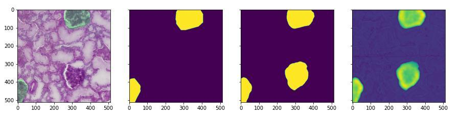

This repository contains code written during participation in Kaggle competition
['HuBMAP - Hacking the Kidney'](https://www.kaggle.com/c/hubmap-kidney-segmentation).

## Competition Description
### Task
Semantic segmentation: detection of functional tissue units (FTUs) across different tissue preparation pipelines.
### Data
15 train images and 5 test images. *(Amount of images in private dataset is unknown.)*
 Resolution: 30k x 37k pixels at average.
#### Preview - Full Images

#### Preview - Random 2048x2048 Crops

## Results
My model scored at 0.912 [Dice Coefficient](https://en.wikipedia.org/wiki/S%C3%B8rensen%E2%80%93Dice_coefficient)
on public dataset.

## Tested Hypotheses
### Loss Functions
* Dice Loss *(the best performance)*
* Binary Cross-Entropy *(slightly worse than Dice, but takes less time per epoch)*
* Binary Cross-Entropy with weight for positive class
* Focal Loss

The BCE loss turned out to be the best choice for this task.
It performs slightly worse than Dice Loss, but takes less time to be estimated.
The dice loss may be utilized on the final stage to fine tune the model.

### Architectures
* U-Net
* FPN

I tried U-Net and FPN with several backbones:
* EfficientNet-b0 / b2 / b4 / b6
* Xception
* Resnet50

EfficientNets showed the best results; almost no difference between b0-6.

Pretrained (ImageNet) backbones provide better results, than randomly initialized weights.

### Tiles Slices
Tried:
* cut original images into 1024x1024 slices and resize to 256x256
* cut original images into 1536x1536 slices and resize to 256x256
* cut original images into 1536x1536 slices and resize to 512x512

The best results were obtained with cuts 1536x1536 resized to 512x512

### Tiles Sample
Targets are not equally distributed around the original picture.
To filter out 'useless' tiles:
* pretrained model on the all the tiles
* made predictions for the training tiles
* excluded slices with 100% accuracy

This approach allowed dropping >1/2 tiles from the training set, what allowed to:
* speed up model convergence
* decrease training time

## Next Steps
Analysis of models' predictions showed that the dataset contains lots of unannotated targets.
That data re-annotation will lead to tangible model improvement.

### Missing Annotation Example

*Image+Target | Target | Prediction Binary | Prediction Logit*